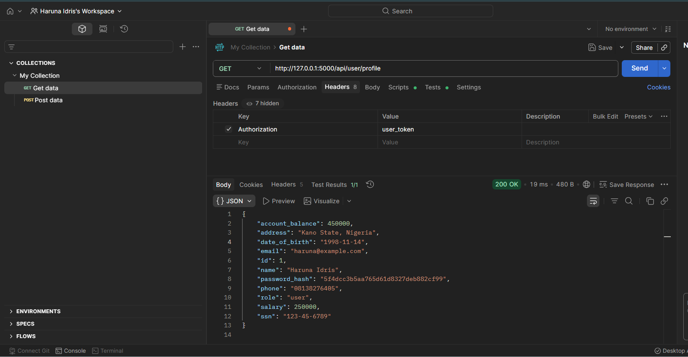
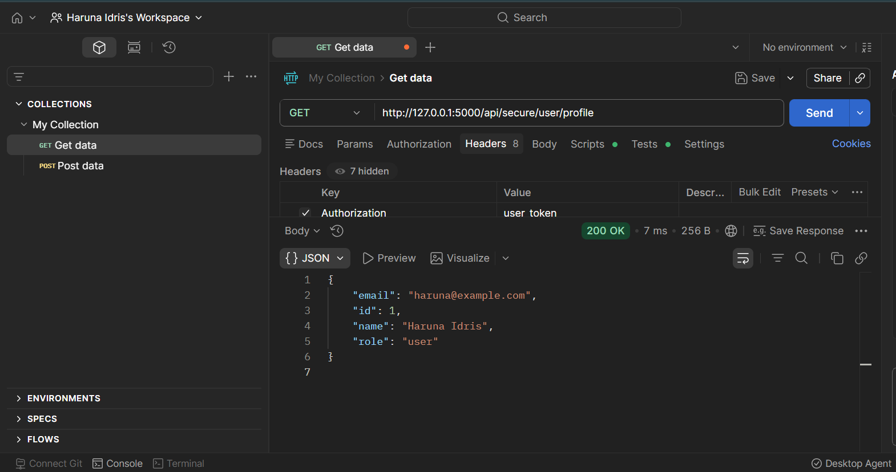

# Excessive Data Exposure | API Security Lab

## What is Excessive Data Exposure?
Excessive Data Exposure occurs when an API returns more data than the 
client actually needs. The server exposes the full object and trusts 
the frontend to filter what to display. An attacker who intercepts 
the response harvests sensitive data that was never meant to be visible.

This vulnerability is ranked in the OWASP API Security Top 10.

## Lab Overview
In this lab I built a vulnerable REST API using Python Flask that 
simulates a real-world Excessive Data Exposure vulnerability. I 
exploited it to retrieve sensitive user data, then implemented a 
secure version that returns only the fields the client actually needs.

## Tools Used
- Python 3
- Flask
- Postman

## Sensitive Data Exposed in Vulnerable Endpoints
| Field | Sensitivity |
|---|---|
| password_hash | 🔴 Critical |
| ssn | 🔴 Critical |
| account_balance | 🔴 High |
| salary | 🔴 High |
| date_of_birth | 🟡 Medium |
| phone | 🟡 Medium |
| address | 🟡 Medium |

---

## Attack 1 — Single User Profile Exposes Sensitive Data

**Request:**
- Method: GET
- URL: `http://127.0.0.1:5000/api/user/profile`
- Header: `Authorization: user_token`

**Result: 200 OK**

A simple profile request returned 13 fields including password hash,
SSN, salary, account balance, date of birth, phone and address.



**Why it happened:**
The API returned the entire user object from the database, trusting 
the frontend to filter sensitive fields — but an attacker intercepts 
the raw API response before the frontend can hide anything.

---

## Attack 2 — All Users Exposed With Full Sensitive Details

**Request:**
- Method: GET
- URL: `http://127.0.0.1:5000/api/users`
- Header: `Authorization: user_token`

**Result: 200 OK**

Every user in the system was returned with complete sensitive data 
including password hashes, salaries, SSNs and account balances for 
all users simultaneously.


**Why it happened:**
Same root cause — no data filtering at the API layer. The entire 
database object was serialised and returned directly to the client.

---

## The Fix — Return Only What Is Needed

**Request:**
- Method: GET
- URL: `http://127.0.0.1:5000/api/secure/user/profile`
- Header: `Authorization: user_token`

**Result: 200 OK — 4 fields only**

The secure endpoint returned only the fields the client actually 
needs — id, name, email and role. All sensitive data was stripped 
at the API layer before the response was sent.



**How it was fixed:**
```python
safe_data = {
    "id": user["id"],
    "name": user["name"],
    "email": user["email"],
    "role": user["role"]
}
return jsonify(safe_data), 200
```

Never return full database objects. Always define exactly what 
fields to expose.

---

## Real World Impact
If this vulnerability exists in a production system:
- Attackers harvest password hashes for offline cracking
- Full identity theft using SSN, DOB and address
- Financial fraud using exposed account balances
- Salary data leaks across entire organisation
- Mass privacy violation affecting all users simultaneously

## Key Lesson
**Never trust the frontend to hide sensitive data.**
Filter at the API layer — return only what the client needs, 
nothing more.

## Remediation
- Define explicit response schemas for every endpoint
- Never serialise and return full database objects directly
- Apply the principle of data minimisation
- Use an allowlist approach — specify what TO return, not what to hide
- Conduct regular API response audits to check for data leakage

## OWASP API Security Top 10 Series
| Lab | Vulnerability | Status |
|---|---|---|
| Lab 1 | BOLA — Broken Object Level Authorization | ✅ Complete |
| Lab 2 | Broken Authentication | ✅ Complete |
| Lab 3 | BFLA — Broken Function Level Authorization | ✅ Complete |
| Lab 4 | Excessive Data Exposure | ✅ Complete |

## References
- [OWASP API Security Top 10](https://owasp.org/API-Security/)
- [OWASP Excessive Data Exposure](https://owasp.org/API-Security/editions/2023/en/0xa3-broken-object-property-level-authorization/)
